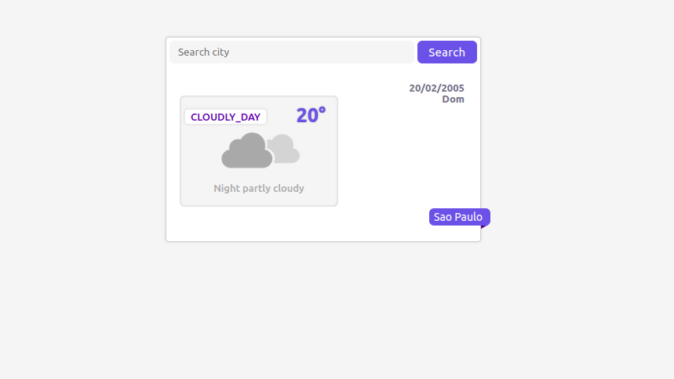

# CityWeather
CityWeather is a project where the user will be able to obtain information about climates of any desired city



### First Steps
- got to the [hgbrasil](https://hgbrasil.com/status/weather/) and login

- change the keyApi variable to your key

```javascript
const keyApi = 'insira sua chave aqui';
```

---

### Task
- [x] Create Front-End (HTML)
- [x] Connect API